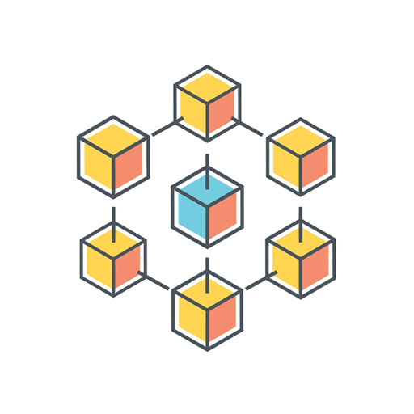
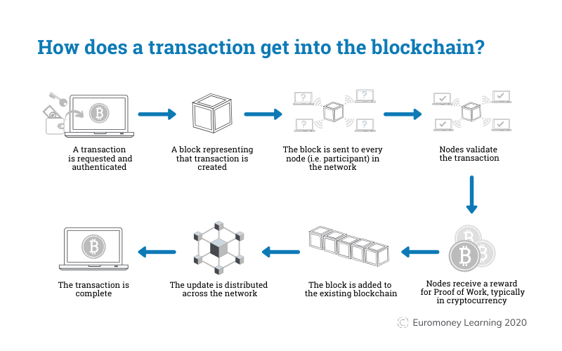
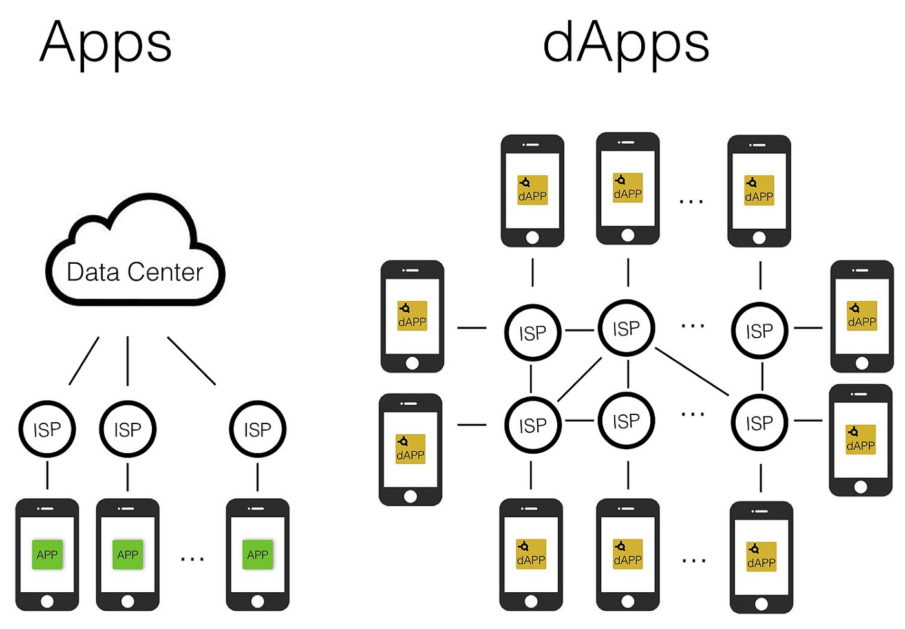
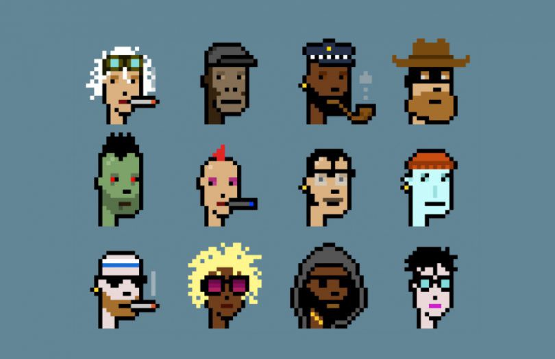

Imagine that you have the power to own your data, make transactions without fees, generate your own assets, would it be great? Well, with Web 3.0 obtaining this power is POSSIBLE!

And in this article, you will know the secrets behind web 3.0 and how you can generate the maximum profit out of it before the masses know it.

Before you dive into web 3.0 you have to understand what are web 1.0 & web 2.0 are to fully get why web 3.0 is revolutionary.

# Web 1.0

Web 1.0 is the **Static** page on the internet where you as a user don’t interact with the server of the website, for example (Wikipedia, Documentations, Blogs).

You just surf the website information, reading its content without the ability to edit or change it.

Most of these websites are not profitable, since they don't support ads, leading to no source of income.

The website doesn’t collect any data about its guests, therefore, all users have the same page loading up not like on web 2.0 as we will see further. These websites are commonly called **Read-only** websites.

# Web 2.0

Getting to Web 2.0 was really revolutionary, it unlocked a lot of opportunities and possibilities for its clients through the **use of their data**. collecting user data from surfing on the internet makes the website know about you more than you know about yourself!!!

**Web 2.0 Examples** are all around you Facebook, google, youtube, Instagram, e-commerce and so more.

Using your data websites can recommend to you ads that you are more likely gonna buy because they know your needs, and this is done using Data Analysis & AI Models and recommendation systems.

**Notice** that on web 2.0 all the control over the data *is in the hand of the company but not the user as in web 3.0 as explained further.

Those websites gain money from making you spend the most amount of your time on them because you are their product, by sticking you into their infinite loop of ads, posts, videos, stories. etc.

# Web 3.0

On web 3.0 you own your data not like before, which makes it more secure and safe for all users.

It is based on the idea of Blockchain, but what does blockchain mean?

**Blockchain** is a set of transactions that are linked to each other which makes each block undeletable, but since you use your data to create a block won't that make anyone on the network get the details and data of your transaction?

Well no, When you create a block you secure it by hashing all data using your private key.

But what does a private key mean?

**A private key** is a password you use to send Transactions and Payments from your wallet to others by signing your transaction block with it.

Of course, I recommend you to save it somewhere offline(hard disk, flash drive), because whoever has this key owns your money.
> **Private Key = Your Wallet**

But your wallet needs more than a private key, it needs another key that identifies the wallet address to receive transactions, for that public key comes to place.

**A public key** is an address, which is used to receive transactions on your wallet.

Once you have created your own block what is left is to add it to the chain, here is a diagram that explains who does that happen.

For more understanding of how transactions are made visit [Euromoney](https://www.euromoney.com/learning/blockchain-explained/how-transactions-get-into-the-blockchain).

# DAPP (Decentralized Application)

DAPP means that the application is not owned by a specific company or organization, everything is completely transparent and viewable on the blockchain itself, making all the content on the apps completely unrestricted, This sounds good, but removing restrictions on people may lead to a mess due to the absence of censorship.

Now let’s make some money and get into the business, for that we need an e-wallet since green papers are useless on web 3.0

The most popular 1# wallet is [MetaMask](https://metamask.io/)

MetaMask allows you to manage your crypto, buy, save or make any transaction you want.

Now let’s buy some NFT and make some money, but do you know what is that even is??

# NFT (Non-fungible Token)

There are 2 types of tokens around, FT & NFT

A **fungible token** is a token that has the same price all over the network like cryptocurrency(ETH, BitCoin, etc)
> ETH = Another ETH

But a **non-fungible** token is more like an asset, it has different prices depending on what they represent (digital art set, real state, etc).
> NFT **!=** Another NFT

Purchasing of course is made in cryptocurrency(ETH).

You may ask why especially ETH but not any other crypto like BTC, well this is since on web 3.0 they commonly use the concept of Smart Contract which is supported on ETH and not BTC, for well understand of smart contract watch this [video](https://www.youtube.com/watch?v=pyaIppMhuic&ab_channel=WhiteboardCrypto).

Interested in buying or creating your first NFT token and making billions and trillions of dollars have a look at the most popular [NFT marketplace](https://opensea.io/).

So, after all, that should you get into this HYPE ???

**YES,** but more importantly is to ask when to do so, web 3.0 is like any newly created technology coming out, It is gonna have its ups & downs as any tech came before. so I recommend you just keep a link with it to join at the right time. for me, I am still discovering the potentials and of this field, Because I believe it is gonna be a life-changing TECH and I wanna get on the RIDE!!!

P.S I have made a UI Application that works with life BC that creates a block and adds it to a live BC you can have a look at it on my [Git](https://github.com/AhmedHelay/Blockchain-UI).

# References

* [FireShip Video on Web 3.0](https://www.youtube.com/watch?v=wHTcrmhskto&ab_channel=Fireship)

* [White Board Crypto explain Web 3.0](https://www.youtube.com/watch?v=nHhAEkG1y2U&t=447s&ab_channel=WhiteboardCrypto)

* [BC Transaction process](https://www.youtube.com/watch?v=nHhAEkG1y2U&t=447s&ab_channel=WhiteboardCrypto)

* [White Board Crypto explains NFT](https://www.youtube.com/watch?v=4dkl5O9LOKg&ab_channel=WhiteboardCrypto)

* [Article gifs](https://giphy.com/)

