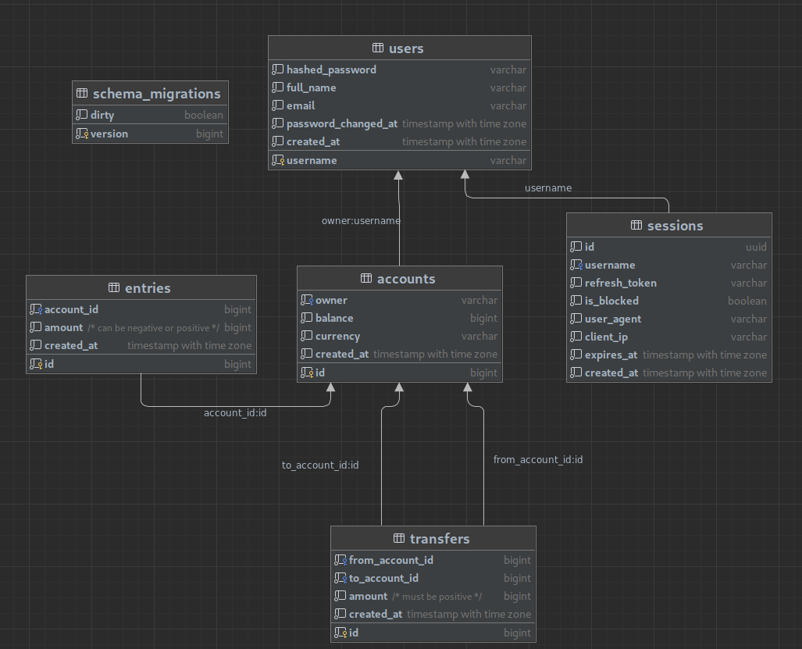

In this article I'll be talking about my latest but not the least project on golang `GOBANK`

The project is a simple implementation of a bank service

I have learned a lot on this course like

1. gin
2. grpc
3. protobuf
4. sqlc
5. Makefile

And that is just to name a few



---

Now let's actually dive in what this project is all about

## Structure

I am only going to mention the most important dirs

### Database

`db` is the dir responsible to handel all the following

1. make db transaction(with tests)
2. store schema & queries used by sqlc to generate
3. sqlc generated code to interact with db
4. `mock db` which is a sub package under `db` that just mocks the db calls, extensively used in api testing
  
So now I think it might be a good time to show the db schema of that project



Actually working with `sqlc` was so useful since it automates a lot of db stuff instead of making it yourself, I also prefer to use it over `gorm` because first it is faster & it strengths you sql in some manner since you will have to write some queries by yourself.

So in the next section I'll be going on depth on how I the db relations work.

### API

In this project I decided to go with `gin` a golang web framework.

It had a lot of features that eases the handling of requests

- request params validations
- error handling
- convenient interface functions to work with
- bind data from json, uri & query

So in short the gin server was handling the following request

### Endpoints

```golang
router := gin.Default()

authGroup := router.Group("/").Use(authMiddleware(server.tokenMaker))

{
  // Account Routes
  authGroup.POST("/api/accounts", server.createAccount)
  authGroup.GET("/api/accounts/:id", server.getAccount)
  authGroup.GET("/api/accounts", server.listAccounts)
  authGroup.DELETE("/api/accounts/:id", server.deleteAccounts)

  // Transfer Routes
  authGroup.POST("/api/transfers", server.createTransfer)

  // User Routes
  authGroup.GET("api/users/:username", server.getUser)
  authGroup.PATCH("api/users", server.updateUser)
}

// Unauthenticated Routes
router.POST("api/users", server.createUser)
router.POST("api/users/login", server.loginUser)
router.POST("api/users/renew", server.renewAccessToken)

server.router = router
```

As you can see some requests require authentication, for token creating and verifying I used [paseto](https://paseto.io/),
Which is a very powerful secured token issuer, even better than `JWT`, But anyway I have implemented both approaches to get the most out of this project.

Here is the [token makers implementation](https://github.com/escalopa/gobank/tree/main/token)

### gapi

Well now we are getting to the most important part of this project, the `gapi` package

It was the first time I was working with `grpc` and `protobuf` and I have to say it was a great experience  since it is a very powerful tool to work with.

In the grpc server I didn't implement all the endpoints, that was implemented in the gin server, but I did implement the following

```proto
// Auth gRPC calls
rpc Login(LoginRequest) returns (LoginResponse) {}

// service created but not implemented
rpc Logout(LogoutRequest) returns (google.protobuf.Empty) {}

// User gRPC calls
rpc CreateUser(UserRequest) returns (UserResponse) {}

rpc GetUser(Username) returns (UserResponse) {}

rpc UpdateUser(UserUpdateRequest) returns (UserResponse) {}

rpc DeleteUser(Username) returns (google.protobuf.Empty) {}
```

For more in depth check the [gapi](https://github.com/escalopa/gobank/tree/main/gapi) dir

So yeah, that's all for this article it was a nice project to work on and have learned a lot from it.

I hope you enjoyed it and if you have any questions or suggestions feel free to contact me on [telergram](https://t.me/escalopas)
