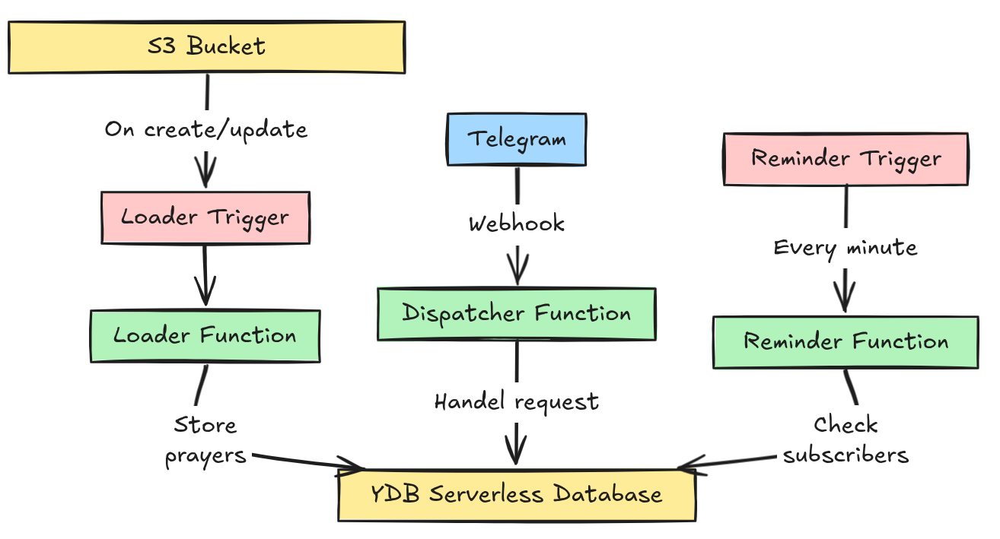


How I built a serverless prayer time bot on Telegram using Yandex Cloud.



[@kazan\_prayer\_bot](https://t.me/kazan_prayer_bot)


 



## Problem

* As a Muslim, I strive to pray on time, but my busy schedule sometimes causes me to miss prayer times.
* Although many apps are available for prayer reminders, as a developer, I spend most of my time on a laptop.
* I wanted a way to receive prayer notifications directly on my laptop.
* Since I was already using Telegram extensively, I decided to build a Telegram bot that would send me prayer time notifications.

Now that you have the context, let’s dive into how I built this bot.

## Serverless

The bot is designed to be serverless, meaning it runs entirely in a cloud environment without the need for dedicated servers or manual infrastructure management.

This approach provides:

* Easy deployment
* Automatic scaling
* Cost efficiency (which is why I migrated from a VPS to a serverless setup)

Here’s an overview of the bot’s architecture:

| Component    | Purpose                                            |
|--------------|----------------------------------------------------|
| `dispatcher` | Handles incoming messages and user interactions.   |
| `reminder`   | Sends prayer time reminders to subscribed users.   |
| `loader`     | Loads prayer times from S3 and stores them in YDB. |

## YDB

I chose **YDB** for several reasons:

* **Serverless:** No need to manage virtual machines, clusters, or scaling — you pay only for what you use.
* **SQL Support:** YDB supports familiar SQL queries, making integration straightforward without complex query builders.
* **Cost:** It’s free up to a generous quota — perfect for prototyping and small-to-medium scale applications.
* **Exploration:** I wanted to explore new technology and expand my database experience beyond PostgreSQL and MongoDB.

The bot uses two main tables:

### `chats` table

| Column                | Type     | Purpose                                                                 |
|-----------------------|----------|-------------------------------------------------------------------------|
| `chat_id`             | Int64    | Unique identifier for the Telegram chat.                                |
| `bot_id`              | Int64    | Unique identifier for the bot instance.                                 |
| `language_code`       | Utf8     | Language selected by the user for localized messages.                   |
| `state`               | Utf8     | Current user interaction state (e.g., awaiting input, viewing results). |
| `reminder_offset`     | Int32    | Time offset for prayer reminders (in minutes).                          |
| `reminder_message_id` | Int32    | ID of the reminder message sent (used to delete old reminders).         |
| `subscribed`          | Bool     | Whether the user is subscribed to notifications.                        |
| `subscribed_at`       | Datetime | Timestamp of when the user subscribed.                                  |
| `created_at`          | Datetime | Timestamp of when the chat record was created.                          |

### `prayers` table

| Column        | Type     | Purpose                                     |
|---------------|----------|---------------------------------------------|
| `bot_id`      | Int64    | Unique identifier for the bot instance.     |
| `prayer_date` | Date     | Date for which prayer times are calculated. |
| `fajr`        | Datetime | Fajr prayer time.                           |
| `shuruq`      | Datetime | Shuruq (sunrise) time.                      |
| `duhr`        | Datetime | Duhr prayer time.                           |
| `asr`         | Datetime | Asr prayer time.                            |
| `maghrib`     | Datetime | Maghrib prayer time.                        |
| `isha`        | Datetime | Isha prayer time.                           |

## Languages

The bot supports multiple languages for user interaction.

Translation templates are located in:
`serverless/dispatcher/internal/handler/languages/`

Currently supported languages:

* Arabic (`ar`)
* English (`en`)
* Spanish (`es`)
* French (`fr`)
* Russian (`ru`)
* Turkish (`tr`)
* Tatar (`tt`)
* Uzbek (`uz`)

Each language is represented as a YAML file containing the necessary translations.

## Deployment

As mentioned earlier, the bot runs serverlessly on **Yandex Cloud**.

For infrastructure management, I used [Terraform](https://www.terraform.io/) to provision all necessary resources.

You can view the Terraform configuration file [here](https://github.com/escalopa/prayer-bot/blob/main/main.tf).
